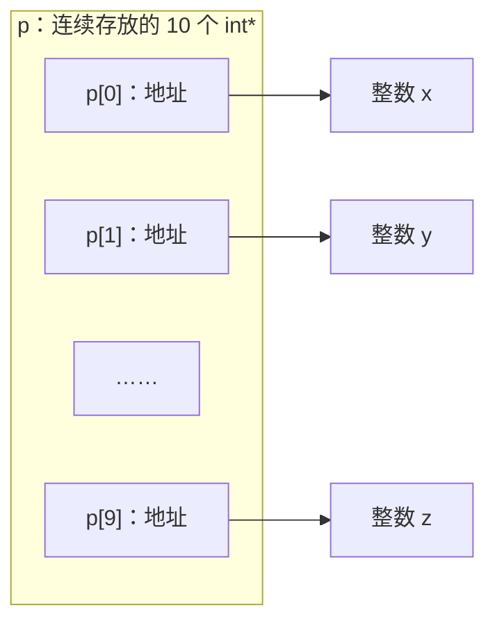
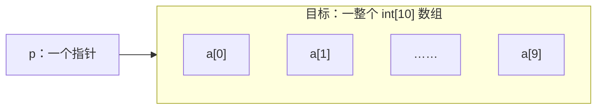
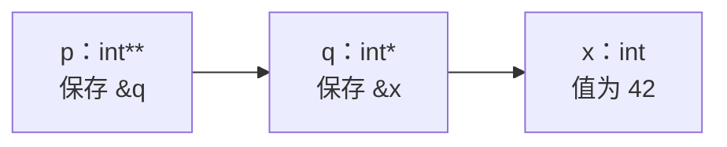
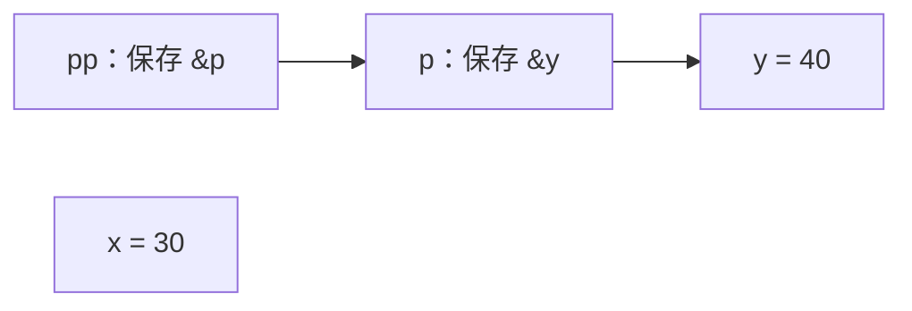

# 2026-09-24（W1 · 周四）

## 今日任务

- 阅读《C和指针》第 3～6 章，学习 C 指针专题。
- 手画并默写 `int *p[10]`、`int (*p)[10]`、`int **p`、`int *func()` 的区别。
- 完成 5 道指针题，并运行验证。

## 我的回答与核对

### 1. 正确解释 p、&p、*p 和 **pp

**我的回答：**

> p为变量，&p为变量p的地址，*p则为p所指的变量，**pp也为变量p所指的变量（**pp,先取p的地址找到p，再取p中的内容找到所指的变量）

**核对：基本正确，需要明确变量的类型和指向关系。**

```c
int x = 10;
int *p = &x;
int **pp = &p;
```

| 表达式 | 在这个例子中的含义 |
| --- | --- |
| `p` | 指针变量；作为值使用时得到它保存的 `x` 的地址。 |
| `&p` | 指针变量 `p` 自己的地址，类型为 `int **`。 |
| `*p` | 解引用得到整数对象 `x`；读取它得到 `10`，给它赋值会修改 `x`。 |
| `pp` | 指针变量，保存 `p` 的地址。 |
| `*pp` | 解引用得到指针对象 `p`；读取它得到 `x` 的地址。 |
| `**pp` | 再解引用得到整数对象 `x`。 |

修正：`**pp` 并不是自己“取 p 的地址”，而是先使用 `pp` 已经保存的地址找到 `p`，再使用 `p` 保存的地址找到 `x`。只有满足 `pp = &p` 等正确指向关系时，`**pp` 和 `*p` 才指向同一个对象。

### 2. 区分 const int *p 与 int *const p

**我的回答：**

> const int *p表示可以修改p指针，但是指针所指的变量无法修改
>
> int *const p表示可以修改所指向的变量，无法修改p指针

**核对：核心区别正确，第一句需要限定“通过 p 修改”。**

| 声明 | 能否改变指向 | 能否通过 p 修改目标整数 |
| --- | --- | --- |
| `const int *p = &x;` | 可以，例如改为指向另一个有效的 `int` 对象。 | 不可以，`*p = 20;` 不允许。 |
| `int *const p = &x;` | 不可以，初始化后不能给 `p` 赋一个新地址。 | 可以，前提是目标对象可修改。 |
| `const int *const p = &x;` | 不可以。 | 不可以。 |

`const int *p` 并不一定使目标对象本身不可修改：

```c
int x = 10;
const int *p = &x;
x = 20; // 合法：x 本身没有声明为 const
// *p = 30; // 不允许：不能通过这个 p 修改 x
```

### 3. 解释指针加一的步长和指针相减的单位

**我的回答：**

> 指针加一的步长为所指变量的大小，指针相减表示两指针相隔的距离

**核对：加一的理解正确，相减的回答需要说明单位和适用条件。**

- 对指向数组元素的 `T *p`，`p + 1` 移动一个 `T` 元素，即 `sizeof(T)` 个 C 字节，而不是移动 `sizeof(p)` 个字节。
- `int *` 加一移动 `sizeof(int)` 字节；`char *` 加一移动 1 字节。
- 两个指针相减得到带符号的元素间距，不是字节距离；结果类型为 `ptrdiff_t`，在 `<stddef.h>` 中声明。
- 相减的指针必须指向同一数组内或末尾后一个位置，差值还必须能由 `ptrdiff_t` 表示。
- 加减整数的结果也必须留在该数组内或末尾后一个位置；末尾后一个位置不能解引用。

```c
int a[5] = {10, 20, 30, 40, 50};
int *p = &a[1];
int *q = &a[4];
// q - p == 3，表示相隔 3 个 int 元素
// p + 1 指向 a[2]
```

### 4. 独立分析 *p++、(*p)++、*++p

**我的回答：**

> *p++：表示先取p所指的变量值，再将p后移一个单位
>
> （*p）++：表示p所指变量的值加一
>
> *++p:表示先将p后一一个单位再取值

**核对：对“移动指针还是修改目标”的判断正确，补充表达式结果和求值规则。**

以下假设指针有效、移动后仍能访问，且需要修改的对象允许修改。每一行都独立从 `int a[] = {10, 20, 30}; int *p = a;` 开始：

| 表达式 | 等价组合 | 作为值使用时的结果 | 完整表达式结束后的变化 |
| --- | --- | --- | --- |
| `*p++` | `*(p++)` | `10` | `p` 指向 `a[1]`，数组内容不变。 |
| `(*p)++` | `(*p)++` | `10`，即修改前的值。 | `a[0]` 变成 `11`，指针不移动。 |
| `*++p` | `*(++p)` | `20` | `p` 指向 `a[1]`，数组内容不变。 |
| `++*p` | `++(*p)` | `11`，即修改后的值。 | `a[0]` 变成 `11`，指针不移动。 |

修正：`*p++` 使用后置自增返回的原指针值来访问对象，`p` 的更新在这个完整表达式结束前完成；不应把它理解为语言保证了“读取对象，然后更新指针”这一具体执行顺序。

## 《C和指针》第 3～6 章重点

参考：用户提供的《C和指针+带书签.pdf》。以下为学习总结与补充示例。

### 第三章：数据

重点是理解类型、声明、作用域、链接属性和生命周期。

| 概念 | 回答的问题 |
| --- | --- |
| 类型 | 数据如何解释？允许哪些操作？ |
| 作用域 | 哪些代码位置能使用这个名字？ |
| 链接属性 | 不同位置的同名声明是否指向同一个实体？ |
| 生命周期 | 对象什么时候存在、什么时候结束？ |

- 用 `sizeof` 查看类型大小，不把 `int` 永远当成 4 字节、`long` 永远当成 8 字节。
- `int *p, q;` 中只有 `p` 是指针；`*` 属于具体的声明项，`q` 是普通整数。
- `typedef` 创建类型别名，不创建变量：`typedef int *IntPtr;` 后，`IntPtr p, q;` 的两个变量都是指针。
- 普通未初始化的局部变量不能直接读取；具有静态存储期的对象默认初始化为零。
- 局部 `static` 变量在函数多次调用之间保留值，但不会因此扩大名字的作用域。
- 文件级 `static` 使变量或函数具有内部链接，限制到当前翻译单元。
- `extern` 常用于引用其他位置定义的对象或函数；应区分声明与定义。
- `const` 与指针的关系见上方回答核对。`const` 限制修改，不意味着对象必然是编译期常量。
- 名字不可见不代表对象已经不存在；作用域和生命周期是两个问题。
- 书中介绍的旧式隐式声明不应照搬到现代 C 代码中，应明确声明类型和函数原型。

### 第四章：语句

| 语句 | 重点 |
| --- | --- |
| `if` | 条件为零是假，非零是真；`else` 匹配最近的未匹配 `if`。 |
| `while` | 先判断，可能一次也不执行。 |
| `do...while` | 先执行，至少执行一次。 |
| `for` | 初始化 → 条件判断 → 循环体 → 更新 → 再判断。 |
| `break` | 退出最近一层循环或 `switch`。 |
| `continue` | 跳过本次循环剩余部分；在 `for` 中接着执行更新表达式。 |
| `switch` | 从匹配的 `case` 开始执行；没有退出语句时会继续执行后续分支。 |

特别注意空语句：

```c
if (condition);  // 分号就是 if 的整个语句体
    work();      // 不受这个 if 控制
```

缩进不决定控制范围，大括号和语法才决定。`if (x = 1)` 是赋值，这个条件为真；`if (x == 1)` 才是比较。`goto` 可以跳转到标签，日常控制流程优先采用清楚的条件和循环结构。

### 第五章：操作符和表达式

#### 位运算、逻辑运算与指针操作

| 运算符 | 含义 |
| --- | --- |
| `~` | 按位取反。 |
| `!` | 逻辑非：零变为 `1`，非零变为 `0`。 |
| `&`、`\|`、`^` | 按位与、按位或、按位异或，操作对应的二进制位。 |
| `&&`、`\|\|` | 逻辑与、逻辑或，结果为 `0` 或 `1`，具有短路行为。 |
| `&x` | 取对象 `x` 的地址。 |
| `*p` | 解引用指针，访问其所指的对象。 |

```c
p != NULL && *p == 10
```

左侧为假时，右侧不求值，可以避免对空指针解引用。按位与 `&` 没有这种短路行为。非空指针也必须满足有效对象和生命周期条件。

#### 左值、类型转换与求值顺序

- 左值可以理解为标识一个对象位置的表达式，例如 `x`、`*p`、`a[i]`；并非所有左值都可修改，例如 `const` 对象。
- 优先级和结合性决定表达式怎样组合，不保证操作数的求值顺序。
- `f() + g()` 不保证 `f()` 先调用。避免在复杂表达式中反复修改同一个变量，例如 `i = i++ + 1;` 存在未定义行为。
- 小整数类型可能先提升为 `int`；有符号与无符号混合运算时也可能发生类型转换。
- 接收结果的类型不能改变前面已经发生的计算类型：

```c
double a = 5 / 2;         // 整数除法先得到 2，再转换为 2.0
double b = (double)5 / 2; // 浮点除法得到 2.5
```

- 前置 `++i` 的结果是新值，后置 `i++` 的结果是旧值；单独作为语句时两者都增加 `i`。
- 移位量必须在允许范围内。有符号移位和溢出还要考虑语言规则，不能直接把 Data Lab 的机器模型当作所有 C 程序的保证。

### 第六章：指针

本章重点是区分指针本身、指向的对象、解引用结果和指针运算。上方四组回答已给出具体解释。

#### 指针有效性

声明指针不会自动分配一个供它指向的整数对象：

```c
int *p;
*p = 10; // 错误：p 尚未初始化，不能解引用
```

- 使用前应让指针指向一个存在且允许访问的对象。
- `NULL` 表示没有指向对象，不能解引用。
- 非空也不一定有效：还可能越界，或指向生命周期已经结束的对象。
- 可以形成数组末尾后一个位置的指针，用于循环终止判断，但不能访问那里。
- 指针不能任意相加；指针与整数的加减、指针相减都有各自的类型和范围限制。

#### 数组与指针

数组不是常量指针。数组名在多数表达式中转换为首元素指针，但数组和指针是不同的类型：

```c
int a[4] = {10, 20, 30, 40};
int *p = a;
// a[2] 与 *(a + 2) 都得到 30
// sizeof(a) 是整个数组的大小
// sizeof(p) 是指针本身的大小
```

数组对象不能像指针变量一样自增。`*a + 2` 是首元素的值加 2，不等价于 `*(a + 2)`。

## 四种声明的图示与解释

关键是先判断：这个名字代表数组、指针，还是函数。从名字 `p` 或 `func` 开始读；括号优先，`[]` 和 `()` 比 `*` 结合得更紧。

以下图示假设指针已正确初始化，箭头表示指向关系。

### 1. int *p[10]：数组，里面装着 10 个指针

先读 `p[10]`：`p` 是数组；再读 `*`：每个元素是指针；最后读 `int`：指向整数。



- `p[0]` 是第一个指针。
- `*p[0]` 是第一个指针所指的整数对象。
- 整个 `p` 占 `10 × sizeof(int *)` 字节。
- 10 个指针元素连续存放，但它们指向的整数不必连续。

### 2. int (*p)[10]：一个指针，指向含 10 个整数的数组

括号让 `*p` 先结合：`p` 是指针，指向的类型是 `int[10]`。



例如：

```c
int a[10] = {0};
int (*p)[10] = &a;
```

- `*p` 是指向的整个数组。
- `(*p)[0]` 是数组的第一个整数。
- `p + 1` 跨过一整个数组，即 `10 × sizeof(int)` 字节；能否解引用新位置取决于范围是否有效。在上面只有一个数组的例子中，可以形成 `p + 1`，但不能解引用它。
- `p` 本身只占一个指针的大小，`sizeof(*p)` 则是 10 个整数的总大小。

### 3. int **p：一个指针，指向另一个指针



对应代码：

```c
int x = 42;
int *q = &x;
int **p = &q;
```

- `p` 保存 `q` 的地址。
- `*p` 得到指针对象 `q`。
- `**p` 得到整数对象 `x`。

两个 `*` 表示两层间接访问，不表示它自带一个数组，也不等同于指向含 10 个整数的数组。

### 4. int *func()：函数，返回一个整数指针

先读 `func()`：`func` 是函数；再读 `int *`：返回值是整数指针。


例如，明确写出无参数版本：

```c
int *func(void) {
    static int x = 42;
    return &x;
}

// 以下语句放在调用者的函数体内
int *p = func();
```

这里 `func` 是函数，`p` 才是保存返回地址的指针。`static` 保证例子中的 `x` 在函数返回后仍然存在；不能用返回普通局部变量地址的方式代替它。

图中展示的是这个返回有效对象地址的例子。返回类型 `int *` 本身不保证返回值可解引用，函数也可能返回 `NULL`。

### 对照记忆

| 声明 | 名字代表什么 | 核心关系 |
| --- | --- | --- |
| `int *p[10]` | 数组 | 数组装指针。 |
| `int (*p)[10]` | 指针 | 指针指数组。 |
| `int **p` | 指针 | 指针指指针。 |
| `int *func()` | 函数 | 函数返回指针。 |

补充区分：`int (*func)(void);` 才是函数指针变量，它指向一个无参数、返回 `int` 的函数；与返回 `int *` 的函数 `int *func(void);` 不同。

## 五道指针题：题目、答案与解析

### 第 1 题：指针与二级指针

#### 题目

```c
int x = 10;
int y = 20;
int *p = &x;
int **pp = &p;

**pp = 30;
*pp = &y;
**pp = 40;
```

1. 最后 `x`、`y`、`*p`、`**pp` 分别是多少？
2. 最后 `p` 指向谁，`pp` 指向谁？
3. `*pp = &y;` 改变的是哪个变量？
4. 画出最后的指向关系。

#### 我的作答与纠错

我的初次回答：`x = 30`、`y = 40`、`*p = 30`、`**pp = 40`，`p` 指向 `x`，`pp` 指向 `y`，`*pp = &y;` 改变的是 `pp`。

其中 `x = 30`、`y = 40`、`**pp = 40` 正确。需要修正：`*pp` 是指针对象 `p`，给 `*pp` 赋值修改的是 `p`，而不是 `pp`。

#### 答案与解析

| 执行步骤 | 实际修改 | 执行后的指向关系 |
| --- | --- | --- |
| 初始化 | `p = &x`，`pp = &p` | `pp → p → x（10）` |
| `**pp = 30;` | 把 `x` 改成 `30` | `pp → p → x（30）` |
| `*pp = &y;` | 把 `p` 保存的地址改为 `&y` | `pp → p → y（20）` |
| `**pp = 40;` | 把 `y` 改成 `40` | `pp → p → y（40）` |

最终：`x = 30`、`y = 40`、`*p = 40`、`**pp = 40`；`p` 指向 `y`，`pp` 始终指向 `p`。



因为 `pp = &p`，`*pp = &y;` 等价于 `p = &y;`。要修改 `pp` 自己，赋值左边应当是 `pp`。

### 第 2 题：读懂四种声明

#### 题目

下面每条声明独立考虑。本题假设 `sizeof(int) == 4`，用到的对象指针大小均为 8 字节。

```c
int *p[10];
int (*p)[10];
int **p;
int *func(void);
```

1. 每个名字代表数组、指针还是函数？
2. 前三条声明中的 `sizeof(p)` 分别是多少？
3. 前两条声明中的 `sizeof(*p)` 分别是多少？这里只分析类型，不读取未初始化的指针。
4. 对第二条声明，若 `p` 指向二维数组的一行，`p + 1` 移动多少字节？
5. 写出一个二维整数数组，并正确初始化第二种指针。

#### 答案与解析

| 声明 | 含义 | sizeof(p) | sizeof(*p) |
| --- | --- | --- | --- |
| `int *p[10];` | 含 10 个整数指针的数组 | `80` 字节 | `8` 字节 |
| `int (*p)[10];` | 指向含 10 个整数的数组的指针 | `8` 字节 | `40` 字节 |
| `int **p;` | 指向整数指针的指针 | `8` 字节 | `8` 字节 |
| `int *func(void);` | 无参数、返回整数指针的函数 | 不适用 | 不适用 |

- 第一条中，`p` 是数组，`*p` 的类型是 `int *`；数组大小为 `10 × 8 = 80` 字节。
- 第二条中，`p` 是指针，`*p` 的类型是 `int[10]`；一行大小为 `10 × 4 = 40` 字节。
- 第三条中，`p` 和 `*p` 都是指针，分别为 `int **` 和 `int *`。
- 第四条声明的是函数，不能对函数本身使用 `sizeof`。
- 第二种指针执行 `p + 1` 跨过一整行，移动 `40` 字节。
- 这里的 `sizeof` 操作数不是变长数组类型，不会对 `*p` 求值，因此不需要先解引用未初始化的指针。

二维数组与指针的初始化示例：

```c
int a[3][10] = {0};
int (*p)[10] = a;      // 等价于 &a[0]

(*p)[0] = 10;          // 修改 a[0][0]
p++;                  // 指向第二行 a[1]
(*p)[0] = 20;          // 修改 a[1][0]
```

记忆：第一种是“数组装指针”，第二种是“指针指数组”。对应图示见上方“四种声明的图示与解释”。

### 第 3 题：指针自增与目标自增

#### 题目

四种情况都独立从以下状态开始，不连续执行：

```c
int a[] = {10, 20, 30};
int *p = a;
```

```c
// 情况 A
int r = *p++;

// 情况 B
int r = (*p)++;

// 情况 C
int r = *++p;

// 情况 D
int r = ++*p;
```

填写每种情况下 `r`、`p` 的指向、`a[0]`、`a[1]`，并说明每个表达式如何加括号。

#### 答案与解析

| 情况 | 表达式的组合 | r | 语句结束后 p 指向 | a[0] | a[1] |
| --- | --- | --- | --- | --- | --- |
| A | `*(p++)` | `10` | `a[1]` | `10` | `20` |
| B | `(*p)++` | `10` | `a[0]` | `11` | `20` |
| C | `*(++p)` | `20` | `a[1]` | `10` | `20` |
| D | `++(*p)` | `11` | `a[0]` | `11` | `20` |

- A：`p++` 提供原指针值用于访问，所以 `r = 10`；语句结束后 `p` 移到下一个元素。不要据此推断解引用与指针更新的具体先后顺序。
- B：增加目标整数；后置自增返回旧值，所以 `r = 10`，但 `a[0] = 11`。
- C：先移动指针，再访问新位置，所以 `r = 20`。
- D：增加目标整数；前置自增返回新值，所以 `r = 11`。

判断时看 `++` 作用于谁：作用于 `p` 就移动指针，作用于 `*p` 就修改目标整数。

### 第 4 题：const 到底限制谁

#### 题目

```c
int x = 10;
int y = 20;

const int *p = &x;
int *const q = &x;
const int *const r = &x;
```

下面每条操作都独立考虑，判断是否合法并解释原因：

```c
p = &y;
*p = 30;

q = &y;
*q = 30;

r = &y;
*r = 30;

x = 40;
```

如果只执行最后的 `x = 40;`，随后读取 `*p` 会得到什么？为什么？

#### 答案与解析

| 操作 | 是否合法 | 原因 |
| --- | --- | --- |
| `p = &y;` | 合法 | `p` 可以改变指向。 |
| `*p = 30;` | 不合法 | 不能通过 `p` 修改目标整数。 |
| `q = &y;` | 不合法 | `q` 是常量指针，不能改变指向。 |
| `*q = 30;` | 合法 | `q` 指向的对象 `x` 可以修改。 |
| `r = &y;` | 不合法 | `r` 的指向不能改变。 |
| `*r = 30;` | 不合法 | 不能通过 `r` 修改目标整数。 |
| `x = 40;` | 合法 | `x` 本身没有声明为 `const`。 |

如果只执行 `x = 40;`，之后 `*p` 得到 `40`。`p` 仍指向 `x`；`const int *p` 只限制通过 `p` 修改，并没有把 `x` 本身变成常量。

### 第 5 题：用双指针反转字符串

#### 题目

实现 `void reverse(char *s);`：

- 原地修改字符串。
- 只使用指针访问字符，不使用下标 `[]`。
- 不调用字符串库函数。
- 正确处理空字符串和单字符字符串。
- 假设传入的是有效、可修改、以 `\0` 结尾的字符数组。

| 输入 | 反转后的内容 |
| --- | --- |
| `"hello"` | `"olleh"` |
| `"abcd"` | `"dcba"` |
| `"a"` | `"a"` |
| `""` | `""` |

同时解释：空字符串为什么不能直接把末尾指针减一？

#### 答案代码

```c
void reverse(char *s) {
    // 空字符串没有可交换的字符
    if (*s == '\0') {
        return;
    }

    char *left = s;
    char *right = s;

    // 找到字符串末尾的 '\0'
    while (*right != '\0') {
        right++;
    }

    // 移到最后一个字符
    right--;

    // 两端交换，向中间移动
    while (left < right) {
        char temp = *left;
        *left = *right;
        *right = temp;

        left++;
        right--;
    }
}
```

#### 解析

以 `"hello"` 为例，先交换 `h` 和 `o`，再交换 `e` 和 `l`：

```text
hello
↑   ↑     交换 h 和 o

oellh
 ↑ ↑      交换 e 和 l

olleh     两指针到达中间，结束
```

- 空字符串：直接返回。
- 单字符字符串：`left == right`，无需交换。
- 普通字符串：交换两端字符，再向中间移动，直到指针相遇或交错。

空字符串的第一个字符就是 `\0`，此时末尾指针等于起点。再减一会形成数组起点之前的指针，属于未定义行为，即使不解引用也不允许。

测试时使用可修改的数组：

```c
char s[] = "hello";
reverse(s);
printf("%s\n", s); // olleh
```

以上为参考答案记录；仓库练习源文件中的实现进度应以实际代码和运行结果为准。
