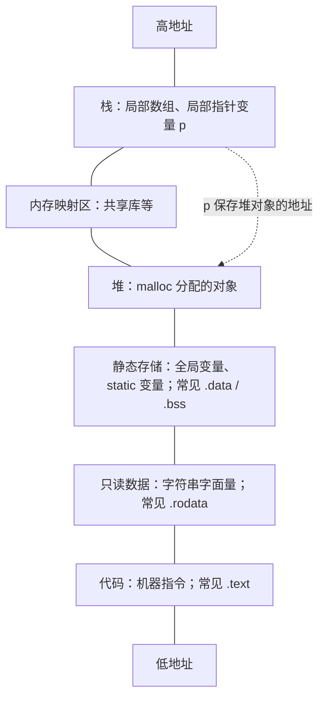
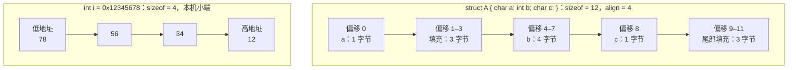

# 2026-09-27


## 手写 `strcpy` 和 `memcpy`：检查与修正

### 我的手写原稿（按原样保留）

```text
char strcpy(dst,src){
   for (int i=0;src[i]!='\0';i++){
   dst[i]=src[i]
      }
      dst[i+1]='\0'
   }


void memcpy(dst, src, n){
    for(n,int i=0;n>0;n--,i++){
    dst[i]=src[i];
        }
}
```

### 检查结果与修正版

原稿中的两个函数目前都不能编译，思路里的“逐个复制”是对的，但有这些具体问题：

| 函数 | 原稿问题 | 修正依据 |
| --- | --- | --- |
| `strcpy` | 参数没有类型；返回类型写成 `char` 且没有返回值；赋值语句缺分号。 | 目标和来源分别是 `char *`、`const char *`；返回原目标指针。 |
| `strcpy` | `i` 声明在 `for` 内，循环后不能使用；终止符应写到 `dst[i]`，不是 `dst[i+1]`。 | 长度为 `i` 的字符串占 `i + 1` 字节，末尾 `\0` 位于下标 `i`。 |
| `memcpy` | 参数没有类型，`for(n,int i=0;...)` 不是合法的 `for` 语法。 | `n` 使用 `size_t`，按 `0` 到 `n-1` 遍历。 |
| `memcpy` | 返回类型写成 `void`；没有说明如何逐字节访问任意对象。 | 返回原目标指针；将指针转成 `unsigned char *` 后复制字节。 |

下面用 `my_` 前缀区分练习函数与标准库同名函数；参数顺序和返回值遵循标准库接口。

```c
#include <stddef.h>  // size_t

char *my_strcpy(char *dst, const char *src)
{
    size_t i = 0;
    while (src[i] != '\0') {
        dst[i] = src[i];
        ++i;
    }
    dst[i] = '\0';  // 连结尾的 NUL 一起复制
    return dst;
}

void *my_memcpy(void *dst, const void *src, size_t n)
{
    unsigned char *d = dst;
    const unsigned char *s = src;
    for (size_t i = 0; i < n; ++i) {
        d[i] = s[i];
    }
    return dst;
}
```

**每一步的越界风险：**

- `my_strcpy` 每次判断 `src[i]` 都会读源内存；源必须在可读区域内含有 `\0`。每次写 `dst[i]`，包括最后写 `\0`，都要求目标有空间：至少 `strlen(src) + 1` 字节。函数本身不知道目标容量，不能自行阻止越界。
- `my_memcpy` 恰好读写 `n` 个字节；源和目标都必须至少有 `n` 个可访问字节。`n == 0` 时循环不读写内存。它不寻找也不补写 `\0`，因此复制出的字节不一定构成 C 字符串。
- 两个函数都要求源和目标区域不重叠；重叠的内存块复制应使用 `memmove`。目标指针还必须指向可写内存，例如不能指向字符串字面量。

## 「C 数据在内存中的真实布局」图

上半部分是常见 Linux x86-64 进程的**虚拟地址空间示意**，不是 C 语言保证的固定地址或精确区段次序。局部变量也可能被优化到寄存器。图中的箭头说明：指针变量本身与它指向的对象是两份不同的存储。



下半部分放大到**对象内部的字节**。`struct A` 的偏移与大小来自 [9 月 25 日的实测](2026-09-25.md)；`int` 的字节顺序使用本机 x86-64 小端结果。地址由左向右增大，填充字节的值不作假设。



`struct A` 若放进数组，下一个元素从前一个元素起点之后 **12 字节**开始。不同平台或编译配置可能有不同的 `int` 大小、对齐及字节序；应以 `sizeof`、`_Alignof`、`offsetof` 和实际字节观察结果为准。
